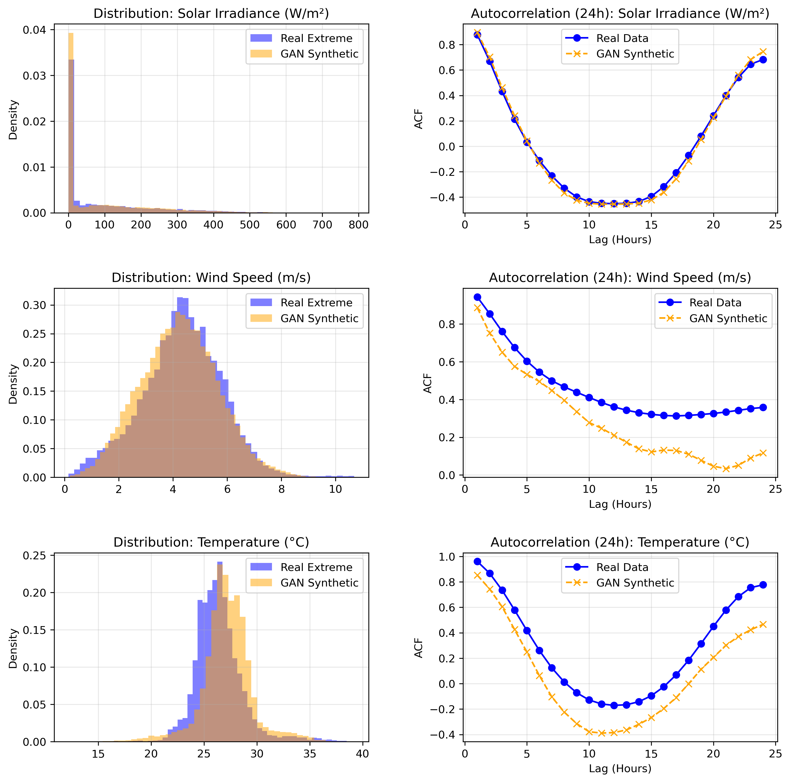

# Training and Validation

## Overview

The Gen-HRES model is a **Conditional Generative Adversarial Network (cGAN)** trained with the **Wasserstein GAN with Gradient Penalty (WGAN-GP)** framework. Both the Generator and Discriminator use **LSTM (Long Short-Term Memory)** layers to capture temporal dependencies in 24-hour weather profiles. Training is implemented in [`train_cgan.py`](train_cgan.py) and validation in [`validate_gan.py`](validate_gan.py).

---

## Part 1: Model Architecture

### Generator

The Generator maps a noise vector and condition labels to a synthetic 24-hour weather profile.

```
Input:
  noise ∈ ℝ^100       (latent vector)
  cond  ∈ ℝ^2         (season, is_extreme)
        │
        ▼
┌─────────────────────┐
│  Label Embedding     │  Linear(2 → 64), repeated 24×
└────────┬────────────┘
         │  concat with noise (repeated 24×)
         ▼
┌─────────────────────┐
│  2-Layer LSTM        │  input_dim=164, hidden_dim=64
└────────┬────────────┘
         ▼
┌─────────────────────┐
│  Linear Output       │  Linear(64 → 3)
└────────┬────────────┘
         ▼
Output: (24, 3)  — 24 hours × 3 features
```

**Key design choice**: Using LSTM layers (rather than 1D convolutions) allows the Generator to model sequential dependencies between hours, producing temporally coherent profiles where each hour's values are influenced by previous hours.

### Discriminator (Critic)

The Discriminator evaluates whether a given 24-hour profile is real or synthetic, conditioned on the same labels.

```
Input:
  profile ∈ ℝ^(24×3)   (weather profile)
  cond    ∈ ℝ^2         (season, is_extreme)
          │
          ▼
┌─────────────────────┐
│  Label Embedding     │  Linear(2 → 64), repeated 24×
└────────┬────────────┘
         │  concat with profile
         ▼
┌─────────────────────┐
│  2-Layer LSTM        │  input_dim=67, hidden_dim=64
└────────┬────────────┘
         ▼  (last hidden state only)
┌─────────────────────┐
│  Linear Output       │  Linear(64 → 1), no sigmoid
└─────────────────────┘
         ▼
Output: scalar (Wasserstein score)
```

**Note**: The Discriminator outputs a raw scalar (no sigmoid activation), consistent with the Wasserstein formulation where the output represents an unbounded "realness" score rather than a probability.

---

## Part 2: Training Configuration

### Hyperparameters

| Parameter | Value | Rationale |
|---|---|---|
| Batch Size | 64 | Balance between gradient stability and memory usage |
| Generator Learning Rate | 5 × 10⁻⁵ | Lower LR for generator stability in WGAN-GP |
| Discriminator Learning Rate | 2 × 10⁻⁵ | Slightly lower than G to avoid critic domination |
| Epochs | 1500 | Extended training for convergence on temporal data |
| Noise Dimension | 100 | Standard latent space size for profile diversity |
| Hidden Dimension | 64 | LSTM hidden units |
| Condition Dimension | 2 | (Season, Is_Extreme) |
| Gradient Penalty Weight (λ) | 10.0 | Standard WGAN-GP penalty coefficient |
| Optimizer | Adam (β₁=0.5, β₂=0.999) | Standard GAN optimizer settings |
| Critic Iterations per G Step | 5 | WGAN-GP standard: train D more than G |

---

### Training Loop

Each epoch iterates over mini-batches with the following structure:

#### Discriminator Update (5× per batch)

1. Sample noise `z ~ N(0, 1)` and generate fake profiles.
2. Compute Wasserstein loss: `L_D = E[D(fake)] - E[D(real)]`
3. Compute gradient penalty on interpolated samples.
4. Total critic loss: `L_D + λ × GP`

#### Gradient Penalty (WGAN-GP)

The gradient penalty enforces the 1-Lipschitz constraint on the Discriminator:

1. Create interpolated samples: `x̂ = α·x_real + (1-α)·x_fake`, where `α ~ U(0,1)`
2. Compute Discriminator output on interpolated samples.
3. Compute gradients of the output w.r.t. the interpolated input.
4. Penalty: `GP = E[(||∇D(x̂)||₂ - 1)²]`

```python
def gradient_penalty(D, real_profiles, fake_profiles, cond):
    alpha = torch.rand(real_profiles.size(0), 1, 1).to(device)
    interpolates = (alpha * real_profiles + (1 - alpha) * fake_profiles).requires_grad_(True)
    d_interpolates = D(interpolates, cond)
    gradients = torch.autograd.grad(...)[0]
    gradients = gradients.reshape(gradients.size(0), -1)
    return ((gradients.norm(2, dim=1) - 1) ** 2).mean()
```

> **Implementation note**: `.reshape()` is used instead of `.view()` to handle non-contiguous tensors safely.

#### Generator Update (1× per batch)

The Generator loss combines three components:

| Component | Formula | Weight | Purpose |
|---|---|---|---|
| **Adversarial Loss** | `-E[D(G(z))]` | 1.0 | Fool the discriminator |
| **Temporal Smoothness** | `MSE(profile[:, 1:], profile[:, :-1])` | 0.05 | Penalize abrupt hour-to-hour jumps |
| **Correlation Loss** | `|corr(wind, temp)_real - corr(wind, temp)_fake|` | 0.8 | Preserve inter-variable relationships |

```
L_G = -E[D(fake)] + 0.05 × L_temporal + 0.8 × L_correlation
```

The **temporal smoothness** term prevents the generator from producing unrealistic spikes between consecutive hours. The **correlation loss** ensures that the physical relationship between wind speed and temperature is preserved in synthetic data.

<!-- GRAPHIC PLACEHOLDER: Training loss curves -->
> 📌 **Suggested Graphic**: Training loss curves showing D_loss, G_loss, and Correlation_loss over epochs. Including a zoomed-in view of the final 200 epochs to demonstrate convergence behavior.

<!-- GRAPHIC PLACEHOLDER: Architecture diagram -->
> 📌 **Suggested Graphic**: A detailed neural network architecture diagram showing both the Generator and Discriminator with layer dimensions, activation functions, and data flow.

---

### Post-Training Generation

After training, the Generator produces **1,000 synthetic extreme-weather profiles**:

1. Condition vector is set to `[0.0, 1.0]` (Dry season, Extreme day) for all 1,000 samples.
2. Random noise is sampled from `N(0, 1)`.
3. Generated normalized profiles are **de-normalized** back to physical units using the original dataset's min/max values.
4. Negative values are clipped to zero (physical constraint: irradiance and wind speed cannot be negative).

The output is exported to `simulink_extreme_forecast.csv` for downstream use in Simulink/MATLAB HRES simulations.

---

## Part 3: Validation

Validation compares GAN-generated extreme-day profiles against **real extreme days** from the preprocessed dataset. Three complementary metrics are used, implemented in [`validate_gan.py`](validate_gan.py).

### Metric 1: Kolmogorov–Smirnov (K-S) Test

The K-S test is a non-parametric test that measures the maximum distance between the cumulative distribution functions (CDFs) of two samples:

$$
D_{KS} = \sup_x |F_{\text{real}}(x) - F_{\text{fake}}(x)|
$$

| Interpretation | K-S Statistic |
|---|---|
| Excellent match | < 0.05 |
| Good match | 0.05 – 0.15 |
| Poor match | > 0.15 |

A low K-S statistic indicates that the generated data follows a similar overall distribution to the real data.

### Metric 2: Jensen–Shannon (J-S) Divergence

The J-S divergence is a symmetric, bounded measure of similarity between two probability distributions:

$$
JSD(P \| Q) = \sqrt{\frac{1}{2} D_{KL}(P \| M) + \frac{1}{2} D_{KL}(Q \| M)}
$$

where $M = \frac{1}{2}(P + Q)$.

| Interpretation | J-S Divergence |
|---|---|
| Excellent match | < 0.05 |
| Good match | 0.05 – 0.15 |
| Poor match | > 0.15 |

Both distributions are discretized into 50-bin histograms with a small epsilon (`1e-10`) added to prevent division by zero.

### Metric 3: Autocorrelation Function (ACF)

The ACF measures temporal memory — how strongly a value at hour `t` correlates with the value at hour `t - lag`. This is computed for lags 1 through 24 (a full day cycle):

$$
\text{ACF}(k) = \frac{\text{Cov}(X_t, X_{t+k})}{\text{Var}(X_t)}
$$

Matching ACF curves between real and synthetic data indicates that the GAN has learned the **temporal structure** of weather patterns — not just the marginal distributions.

<!-- GRAPHIC PLACEHOLDER: Validation results -->
> 📌 **Suggested Graphic**: The `validation_results.png` output from the validation script, showing the 3×2 grid of distribution comparisons (left column) and autocorrelation comparisons (right column) for all three features.

> 📊 **Embed the actual validation output below once generated:**
>
> 

---

### Validation Output Structure

The validation script produces a **3×2 subplot grid** saved as `validation_results.png`:

| Row | Left Column (Distribution) | Right Column (Temporal) |
|---|---|---|
| **Row 1** | Solar Irradiance: Real vs. GAN histogram | Solar Irradiance: ACF comparison (24 lags) |
| **Row 2** | Wind Speed: Real vs. GAN histogram | Wind Speed: ACF comparison (24 lags) |
| **Row 3** | Temperature: Real vs. GAN histogram | Temperature: ACF comparison (24 lags) |

---

<!-- VALIDATION PLACEHOLDER: Summary metrics table -->
> 📊 **Suggested Validation Table**: Fill in after running the validation script:
>
> | Feature | K-S Statistic | K-S p-value | J-S Divergence | ACF Match Quality |
> |---|---|---|---|---|
> | Solar Irradiance (W/m²) | — | — | — | — |
> | Wind Speed (m/s) | — | — | — | — |
> | Temperature (°C) | — | — | — | — |

---

## Summary of Output Files

| File | Source Script | Description |
|---|---|---|
| `cgan_generator.pth` | `train_cgan.py` | Saved Generator model weights |
| `simulink_extreme_forecast.csv` | `train_cgan.py` | 1,000 synthetic extreme-day profiles (de-normalized) |
| `validation_results.png` | `validate_gan.py` | 3×2 validation plot grid |

---

## Dependencies

```
torch
pandas
numpy<2.0.0
matplotlib
scipy
tqdm
```
